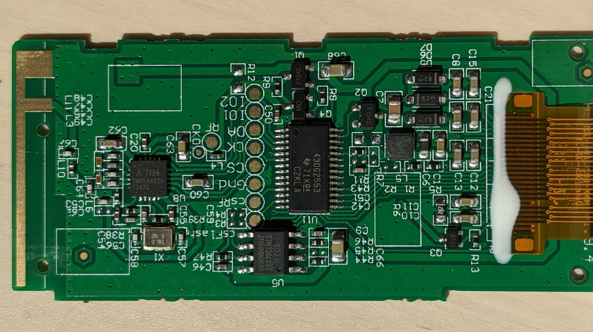
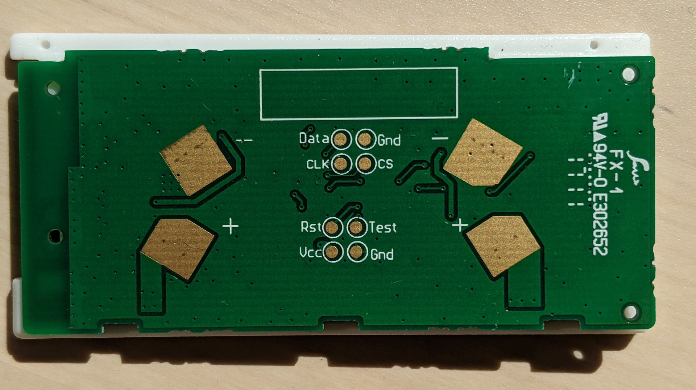
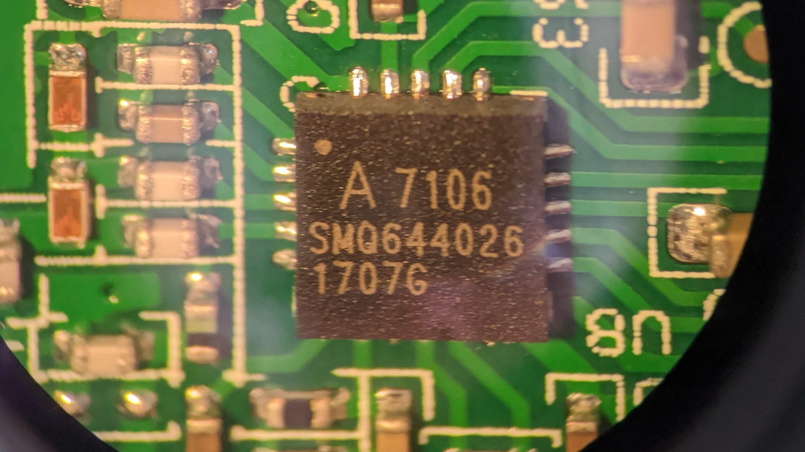
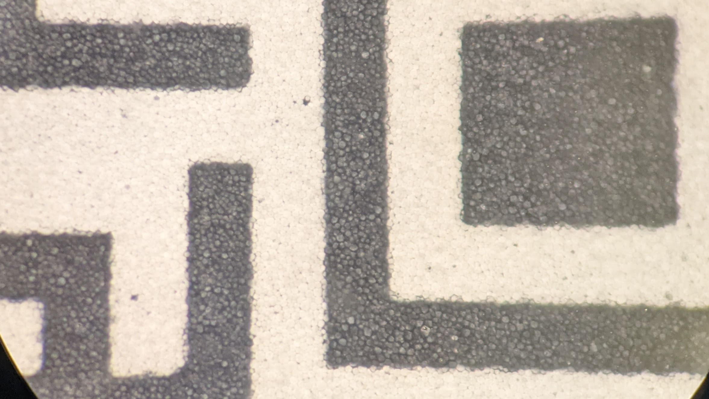

# Hanshow E-Ink price tags


These tags are available very cheaply from second-hand sources,
sometimes as low as $1 each.  They don't have any documentation and
this particaular model are programmed over a 2.4 GHz radio, while others
are programmed via IR photodiodes.

## BOM

* TI [MSP430G2553](https://www.ti.com/product/MSP430G2553), 16KB flash, 512 bytes RAM
* Amiccom [A7106](http://www.amiccom.com.tw/asp/product_detail.asp?CATG_ID=2&PRODUCT_ID=109), 2.4GHz ISM band wireless transceiver
* Winbond [25X10CLNIG](https://www.winbond.com/resource-files/w25x10cl_revg%20021714.pdf), 1 megabit SPI flash
* E-Ink display "E0213A04N175I17", likely 122x250 pixels? Might be compatible with [waveshare 2.13" display](https://www.waveshare.com/wiki/2.13inch_e-Paper_HAT)
* 2x CR2450 batteries in parallel

## msp430 JTAG 



MSP430 "JTAG" is using the bottom four pins:

* `VCC` - 3.3V
* `GND` - `GND`
* `RST` - `TDIO`
* `TEST` - `TCK`

Connect to the explorer board and probe it with:

```
% mspdebug tilib
MSP430_Initialize: ttyACM1
Firmware version is 31300601
MSP430_VCC: 3000 mV
MSP430_OpenDevice
MSP430_GetFoundDevice
Device: MSP430G2xx3 (id = 0x0067)
2 breakpoints available
MSP430_EEM_Init
Chip ID data:
  ver_id:         5325
  ver_sub_id:     0000
  revision:       00
  fab:            60
  self:           0000
  config:         00
  fuses:          00
Device: MSP430G2xx3
```

Memory layout:

* `0x0000 - 0x000F`: Special function registers
* `0x0010 - 0x00FF`: 8-bit peripheral modules
* `0x0100 - 0x01FF`: 16-bit peripheral modules
* `0x0200 - 0x09FF`: SRAM
* `0x0C00 - 0x0FFF`: Boot flash (not sure)
* `0x1000 - 0x107F`: Information memory
* `0xC000 - 0xFFFF`: Code flash

## spi flash


The stock firmware stores the bitmap image in the flash. Extracting it and
plotting it with a 128-bit stride reveals the image.

SPI flash pins:

* `CE` - P3.0 (also pulled high)
* `DO` - P1.6
* `DI` - P1.7
* `CLK` - P1.5
* `!RST` - pulled high
* `!WP` - pulled high

## radio


* `GIO1` - P1.1 (RX data from radio? can be set in mode 0b1000 for direct output)
* `GIO2` - P1.0 (wakeup? ready? can be set to different modes)
* `SDIO` - P1.2 (TX data to radio)
* `SCK` - P1.4 (clock)
* `SCS` - P1.3 (radio chip select)


## e-ink



Not 100% positive about model. Typically they are SPI controlled, plus
some extra pins.  The pinout *appears* to match the waveshare design.

* `EPD BUSY` - P2.5? (based on busy wait sequence)
* `EPD RESET` - P3.6? (based on init sequence, not measured)
* `EPD DC` - P3.5? (data/command selector)
* `EPD CS` - P3.4
* `EPD CLK` - P2.3
* `DI` - P2.4 (data out from mcu into e-ink)
* ??? - P3.1
* ??? - P3.7
* ??? - P2.6 and P2.7 (maybe some sort of transistor controlling the voltage regulators for the eink display?)

Their init sequence:

* P3.1 = 0 (power on?)
* P3.6 = 0 (reset low)
* delay(0x32)
* P3.6 = 1 (reset high)
* delay(0x12)
* 0x12 - sw reset to all parameters (does not clear RAM)
* wait for BUSY/P2.5 to go low

* `0x01 0xF9 0x00` - driver output control, 
* `0x3a 0x06` - set dummy line period
* `0x3b 0x0b` - set gate line width
* `0x11 0x03` - data entry mode X and Y increment, update X direction
* `0x44 0x00 0x0f` - set ram X start and end
* `0x45 0x00 0xf9` - set ram Y start and end (should be four bytes?)
* `0x2c 0x79` - write VCOM register (maybe?)
* `0x3c 0x33` - border waveform control, VSH2, LUT3?
* `0x32 ....` LUT data? sends 30 bytes, datasheet says 100

* `0x21 0x83` - display update control 1?

* `0x4E 0x00` - set X address to 0
* `0x4F 0x00` - set Y address to 0
* `0x24 ....` - send bitmap data (reading from flash)
* `0x22 0xc7` - display update control 2 (enable clock, analog, display mode 1, disable analog, osc)
* `0x20` - active display update sequence (busy goes high)
* wait for BUSY/P2.5 to go low
* `0x10 0x01` - deep sleep mode 1, requires hwreset to exit
* `P3DIR |= 0b11110010`
* `P2DIR |= 0b00011000`
* P2.3 = 1 (clk idle high)
* P2.4 = 1 (data out idle high)
* P3.4 = 1 (!cs, not selected)
* P3.5 = 1 (command, idle high)
* P3.6 = 1 (reset high)
* P3.7 = 1
* P3.1 = 0

```
eink_lut[1]                       XREF[1,  FUN_d56e:d57c(R), 
                    eink_lut                                   FUN_d56e:d57c(R)  
       c294 aa 65 55 8a    db[30]
            16 66 65 18 
            88 99 00 0
         c294 [0]        AAh, 65h, 55h, 8Ah
         c298 [4]        16h, 66h, 65h, 18h
         c29c [8]        88h, 99h,  0h,  0h
         c2a0 [12]        0h,  0h,  0h,  0h
         c2a4 [16]       14h, 14h, 14h, 14h
         c2a8 [20]       14h, 14h, 14h, 14h
         c2ac [24]       14h, 14h,  0h,  0h
         c2b0 [28]        0h,  2h
```

